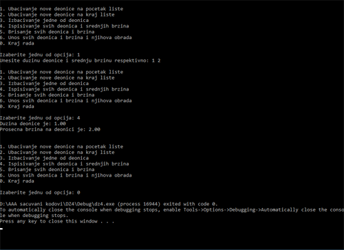
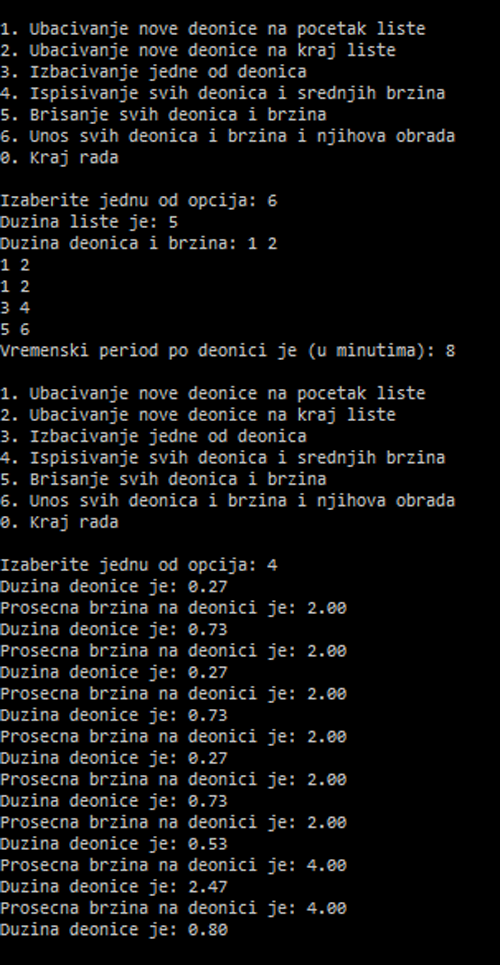

# Speed Calculator

*Console App in C which is working with lists and adds or removes or shows with time and distance of bike stops and calculates speed.*

## Application Design

### *First Set of Commands*

View of the results of first few set of commands.

### *Second Set of Commands*

View of the results of second few set of commands.